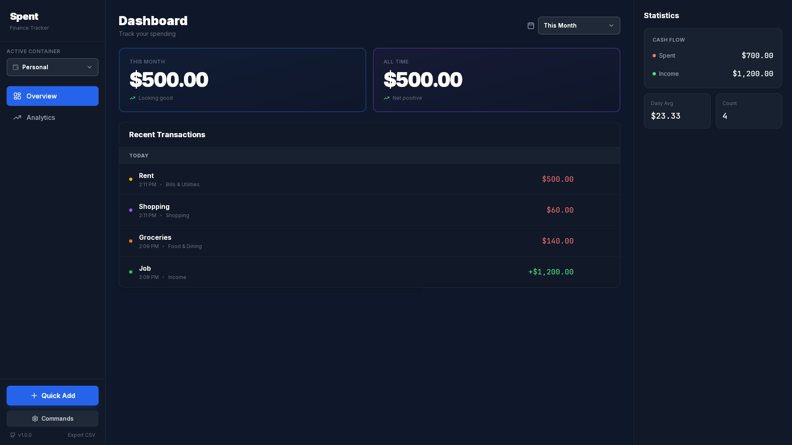

# Spent

Minimalist personal finance tracker for Linux desktop with cross-platform support.



**[View More Screenshots](src-tauri/icons/Media)**

> **Note:** Version 1.0.0 is "feature-complete" but has primarily been tested on Arch Linux. If you encounter issues on other distros or OSs, please open an Issue!

[](https://aur.archlinux.org/packages/spent)
[](https://github.com/FrogSnot/Spent)


## Features

- **Containers**: Create separate balance containers to manage personal, business, or different accounts in complete isolation
- Offline-first with local SQLite storage
- Quick transaction entry (Ctrl+N)
- Monthly balance tracking with history
- Category-based organization
- Dark mode interface
- CSV export per container
- Cross-platform: Linux (.deb, .AppImage), Windows (.exe), macOS (.app)

## Stack

- Backend: Tauri v2 (Rust)
- Frontend: Svelte + TypeScript
- Database: SQLite
- UI: TailwindCSS

## Prerequisites

- Node.js
- Rust
- Linux dev dependencies:
  ```bash
  # Ubuntu/Debian
  sudo apt install libwebkit2gtk-4.1-dev build-essential curl wget file libssl-dev libgtk-3-dev libayatana-appindicator3-dev librsvg2-dev

  # Arch
  sudo pacman -S webkit2gtk-4.1 base-devel curl wget file openssl gtk3 libappindicator-gtk3 librsvg
  ```

## Development

```bash
npm install
npm run tauri dev
```

Build:
```bash
npm run tauri build
```

## Usage

- Launch: `spent-app` (binary renamed from `spent` in v1.1.5 to avoid conflict with opensp package)
- `Ctrl+N` - Add transaction
- `Ctrl+K` - Command palette (access all features)
- Hover transaction to edit/delete
- Switch between containers using the dropdown in sidebar
- Create/manage containers via Command Palette → "Manage Containers"

## Data

The database is stored locally in platform-specific locations:

- **Linux**: `~/.local/share/com.spent.app/spent.db`
- **Windows**: `%APPDATA%\com.spent.app\spent.db` (typically `C:\Users\<username>\AppData\Roaming\com.spent.app\spent.db`)
- **macOS**: `~/Library/Application Support/com.spent.app/spent.db`

Money is stored as integers (cents) to avoid floating-point issues.

## Thank you to the amazing people that star this project!

## Star History

[](https://www.star-history.com/#FrogSnot/spent&type=date&legend=bottom-right)


## License

AGPLv3
