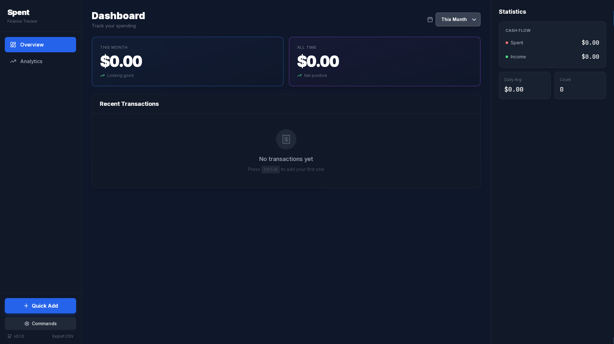

# Spent

Minimalist personal finance tracker for Linux desktop.



## Features

- Offline-first with local SQLite storage
- Quick transaction entry (Ctrl+N)
- Monthly balance tracking
- Category-based organization
- Dark mode interface

## Stack

- Backend: Tauri v2 (Rust)
- Frontend: Svelte + TypeScript
- Database: SQLite
- UI: TailwindCSS

## Prerequisites

- Node.js
- Rust
- Linux dev dependencies:
  ```bash
  # Ubuntu/Debian
  sudo apt install libwebkit2gtk-4.1-dev build-essential curl wget file libssl-dev libgtk-3-dev libayatana-appindicator3-dev librsvg2-dev

  # Arch
  sudo pacman -S webkit2gtk-4.1 base-devel curl wget file openssl gtk3 libappindicator-gtk3 librsvg
  ```

## Development

```bash
npm install
npm run tauri dev
```

Build:
```bash
npm run tauri build
```

## Usage

- `Ctrl+N` - Add transaction
- `Ctrl+K` - Command palette
- Hover transaction to delete

## Data

Stored in `~/.local/share/com.spent.app/spent.db` (Linux).

Money stored as integers (cents) to avoid floating-point issues.

## License

AGPLv3
